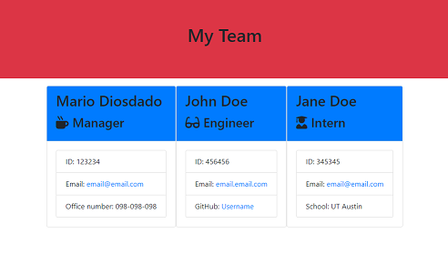

# Team Generator 

This node application creates a team members summary for software engineering. The user needs to respond the questions and after adding all memebers it will generate and HTML file with all the data.

You can find this project here: https://github.com/MarioDiosdado/teamgenerator

## Table of contents

* [Installation](#installation-instructions)
* [Test](#test)
* [Questions](#questions)
            
            
## Installation instructions
    To run the application you need to install npm inquirer.

## Test
This image is a test for the application

## Questions

If you have any questions you can contact me here:

* Github username: https://github.com/MarioDiosdado
* Github profile: https://github.com/MarioDiosdado
* Email: diosdado.mario@gmail.com

            